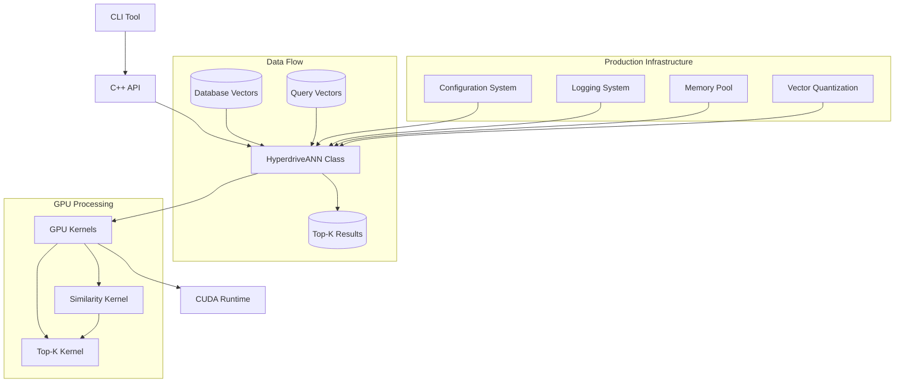
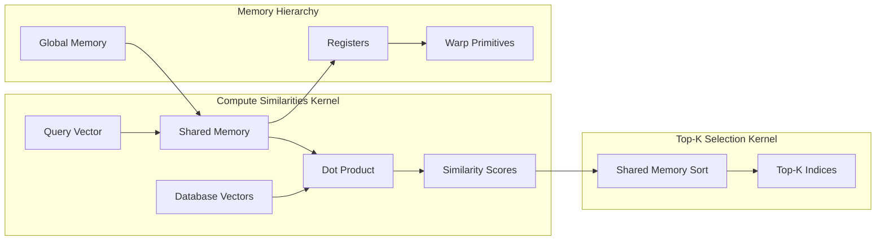
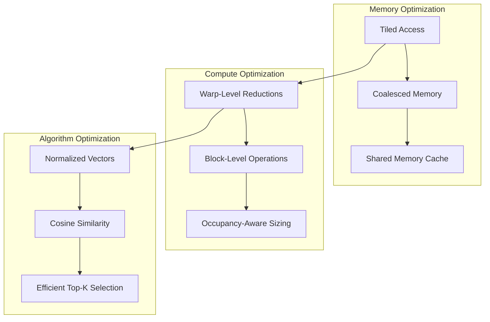
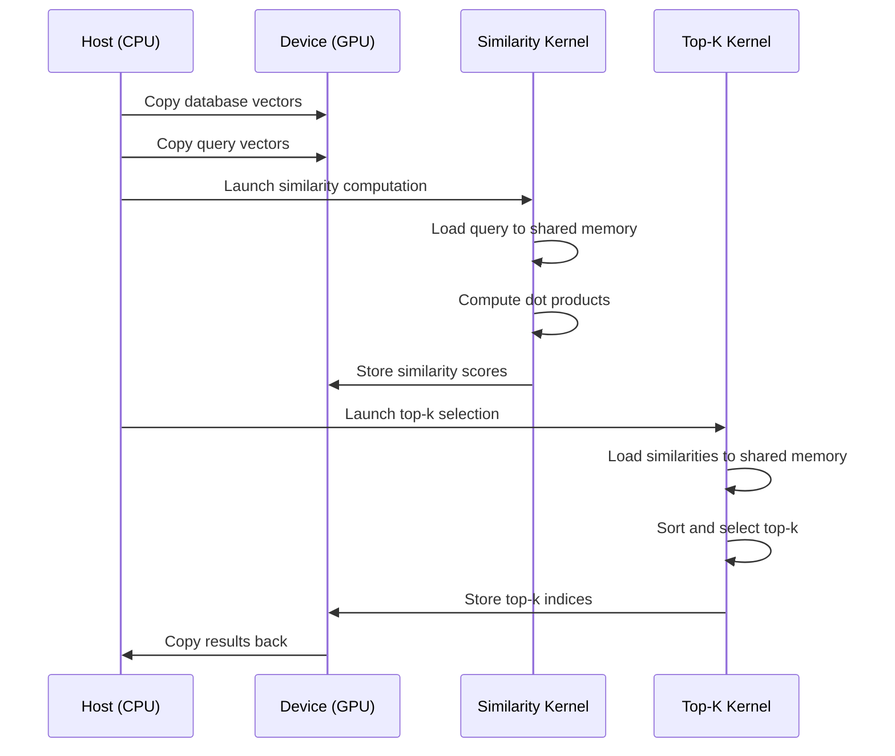

# Hyperdrive-ANN Architecture

## System Overview

Hyperdrive-ANN is a production-ready GPU-accelerated approximate nearest neighbor (ANN) search engine built with CUDA 12.8 and C++20. The system efficiently computes top-k cosine similarity searches across large vector databases using shared-memory tiling, warp-level reductions, and occupancy-aware block sizing. The architecture includes production infrastructure for memory management, logging, configuration, and containerization.

## High-Level Architecture

The system follows a layered architecture where the CLI interface provides user interaction, the C++ API offers programmatic access, and the GPU kernels handle the computationally intensive similarity computations. The production infrastructure layer provides configuration management, logging, memory pool management, and vector quantization capabilities. Data flows from input vectors through the ANN engine to produce ranked similarity results.

## CUDA Kernel Architecture

The CUDA implementation uses a two-phase approach: first computing cosine similarities between query and database vectors using shared memory for efficient data access, then performing top-k selection using shared memory sorting. The memory hierarchy optimization ensures minimal global memory access while maximizing shared memory utilization for faster computation.

## Performance Optimization Strategy

The optimization strategy focuses on three key areas: memory access patterns through tiled and coalesced memory operations, compute efficiency via warp-level reductions and occupancy-aware block sizing, and algorithmic efficiency through normalized vector processing and optimized top-k selection algorithms.

## Data Flow and Memory Management

The data flow follows an asynchronous pattern where data is copied to GPU memory, processed through specialized kernels, and results are copied back to host memory. Each kernel is optimized for specific operations: similarity computation focuses on memory bandwidth utilization while top-k selection emphasizes shared memory sorting efficiency.

## Production Infrastructure

### Configuration Management
The system uses YAML-based configuration files for runtime parameter tuning. Configuration includes memory settings, performance parameters, algorithm options, and logging preferences. The configuration system supports hot-reloading and validation of parameters.

### Memory Pool Management
A custom memory pool implementation manages GPU memory allocation and deallocation efficiently. The pool reduces memory fragmentation and provides better memory utilization through block reuse and stream-aware allocation.

### Logging System
Comprehensive logging infrastructure with multiple log levels (DEBUG, INFO, WARN, ERROR, FATAL). The system supports both console and file output with configurable formatting and automatic log rotation.

### Vector Quantization
Support for INT8 and INT4 vector quantization to reduce memory usage and improve performance. The quantization system includes automatic parameter computation and dequantization for maintaining search accuracy.

### Containerization
Docker support with NVIDIA GPU runtime for easy deployment and scaling. The containerization includes multi-service orchestration with Docker Compose for different deployment scenarios.
